# System Architecture Diagram
## Chauffeur Service Hourly Booking System
### Client: Manivtha Tours & Travels | Author: V.Roopesh (ID: 252U1R1249)

---

## Complete System Architecture (Mermaid.js)

```mermaid
flowchart TB
    subgraph CLIENT["🖥️ CLIENT LAYER — Next.js 16 + Tailwind CSS v4 + TypeScript"]
        direction TB
        UI_ENTRY["📝 Booking Entry Form<br/><i>ChauffeurServiceHourlyBookingEntryForm.tsx</i>"]
        UI_DASH["📊 Live Dashboard<br/><i>ChauffeurServiceHourlyBookingDashboard.tsx</i>"]
        UI_PAY["💳 Payment & Billing Tracker<br/><i>PaymentBillingTracker.tsx</i>"]
        UI_REPORT["📈 Reports & Analytics<br/><i>ReportsAnalyticsDashboard.tsx</i>"]
        UI_CALC["🧮 Core Logic Result<br/><i>ChauffeurServiceCoreLogicResult.tsx</i>"]
    end

    subgraph API_LAYER["⚙️ API GATEWAY — Express.js + TypeScript + Zod Validation"]
        direction TB
        HEALTH["🩺 Health Check<br/><b>GET /health</b>"]
        
        subgraph BOOKING_ROUTES["📋 Booking Routes — routes/booking.ts"]
            direction TB
            POST_BOOK["<b>POST</b><br/>/api/chauffeur_service_hourly_booking<br/><i>Create New Booking</i>"]
            GET_LIST["<b>GET</b><br/>/api/chauffeur_service_hourly_booking<br/><i>List All — Paginated & Filtered</i>"]
            GET_DETAIL["<b>GET</b><br/>/api/chauffeur_service_hourly_booking/:id<br/><i>Single Booking Detail</i>"]
            GET_CALC["<b>GET</b><br/>/api/chauffeur_service_hourly_booking/:id/calculate<br/><i>Fare Computation</i>"]
            PUT_UPDATE["<b>PUT</b><br/>/api/chauffeur_service_hourly_booking/:id<br/><i>Full Update — Planned</i>"]
            PATCH_STATUS["<b>PATCH</b><br/>/api/chauffeur_service_hourly_booking/:id/status<br/><i>Status Toggle — Planned</i>"]
        end

        subgraph PAYMENT_ROUTES["💰 Payment Routes — routes/payments.ts (Planned)"]
            direction TB
            GET_PAY["<b>GET</b><br/>/api/payments<br/><i>List Payments</i>"]
            GET_SUMMARY["<b>GET</b><br/>/api/analytics/summary<br/><i>Revenue Analytics</i>"]
        end
    end

    subgraph SERVICE_LAYER["🧠 SERVICE LAYER — Business Logic Engine"]
        direction TB
        BILLING["💵 Billing Engine<br/><i>services/billingEngine.ts</i><br/><b>calculateBookingBill()</b>"]
        
        subgraph BILLING_RULES["📐 Calculation Pipeline"]
            direction LR
            RULE1["Step 1<br/>Min 4-Hour<br/>Enforcement"]
            RULE2["Step 2<br/>Base Fare<br/>rate × hours"]
            RULE3["Step 3<br/>Peak +15%<br/>Night +20%"]
            RULE4["Step 4<br/>GST 18%<br/>Application"]
            RULE1 --> RULE2 --> RULE3 --> RULE4
        end
    end

    subgraph DATA_LAYER["🗄️ DATA LAYER — PostgreSQL + Prisma ORM v5.22"]
        direction TB
        PRISMA["🔌 Prisma Client<br/><i>prisma.ts — Singleton</i>"]
        
        subgraph DB_TABLES["📦 Database Tables"]
            direction LR
            TBL_CUST["👤 Customer<br/><i>id, name, email,<br/>phone, company</i>"]
            TBL_VEH["🚗 Vehicle<br/><i>id, make, model,<br/>license_plate, category</i>"]
            TBL_BOOK["📋 ChauffeurService<br/>HourlyBooking<br/><i>id, live_meter_billing,<br/>status, created_date,<br/>notes, duration_hours</i>"]
            TBL_PAY["💳 Payment<br/><i>id, amount, method,<br/>transaction_ref, status</i>"]
        end
    end

    %% Client → API Connections
    UI_ENTRY -- "POST /api/chauffeur_service_hourly_booking<br/>JSON: {live_meter_billing, status, created_date, notes}" --> POST_BOOK
    UI_DASH -- "GET /api/chauffeur_service_hourly_booking<br/>?page=1&status=Active&search=..." --> GET_LIST
    UI_DASH -- "GET /api/chauffeur_service_hourly_booking/:id" --> GET_DETAIL
    UI_CALC -- "GET /api/chauffeur_service_hourly_booking/:id/calculate" --> GET_CALC
    UI_PAY -- "GET /api/payments" --> GET_PAY
    UI_REPORT -- "GET /api/analytics/summary" --> GET_SUMMARY

    %% API → Service Connections
    GET_CALC -- "Delegates to" --> BILLING
    BILLING -- "Returns BillingCalculationResult" --> GET_CALC

    %% API → Data Connections
    POST_BOOK -- "prisma.booking.create()" --> PRISMA
    GET_LIST -- "prisma.booking.findMany()" --> PRISMA
    GET_DETAIL -- "prisma.booking.findUnique()" --> PRISMA
    PUT_UPDATE -- "prisma.booking.update()" --> PRISMA
    PATCH_STATUS -- "prisma.booking.update()" --> PRISMA
    GET_PAY -- "prisma.payment.findMany()" --> PRISMA

    %% Prisma → DB Connections
    PRISMA --> TBL_BOOK
    PRISMA --> TBL_CUST
    PRISMA --> TBL_VEH
    PRISMA --> TBL_PAY

    %% FK Relationships
    TBL_CUST -. "1 → Many" .-> TBL_BOOK
    TBL_VEH -. "1 → Many" .-> TBL_BOOK
    TBL_BOOK -. "1 → Many" .-> TBL_PAY

    %% Styling
    classDef clientStyle fill:#0B132B,stroke:#48CAE4,stroke-width:2px,color:#FFFFFF
    classDef apiStyle fill:#1C2541,stroke:#0077B6,stroke-width:2px,color:#FFFFFF
    classDef serviceStyle fill:#0A1128,stroke:#D4AF37,stroke-width:2px,color:#FFFFFF
    classDef dataStyle fill:#1B2A4A,stroke:#48CAE4,stroke-width:2px,color:#FFFFFF
    classDef ruleStyle fill:#162447,stroke:#D4AF37,stroke-width:1px,color:#F8FAFC

    class UI_ENTRY,UI_DASH,UI_PAY,UI_REPORT,UI_CALC clientStyle
    class HEALTH,POST_BOOK,GET_LIST,GET_DETAIL,GET_CALC,PUT_UPDATE,PATCH_STATUS,GET_PAY,GET_SUMMARY apiStyle
    class BILLING serviceStyle
    class RULE1,RULE2,RULE3,RULE4 ruleStyle
    class PRISMA,TBL_CUST,TBL_VEH,TBL_BOOK,TBL_PAY dataStyle
```

---

## Architecture Legend

| Layer | Technology | Port | Role |
|:---|:---|:---|:---|
| **Client** | Next.js 16 + Tailwind CSS v4 + TypeScript | 3000/3001 | Presentation, user interaction, form validation |
| **API Gateway** | Express.js + TypeScript + Zod | 5000 | Request validation, routing, response formatting |
| **Service** | billingEngine.ts (pure TypeScript) | — | Core business logic: surcharges, GST, minimums |
| **Data** | PostgreSQL + Prisma ORM v5.22 | 5432 | Persistent storage, relational integrity, migrations |

## Data Flow Summary

1. **User Action** → Frontend component captures input and calls `fetch()` to the Express API
2. **Zod Validation** → Express middleware validates the JSON payload against the Zod schema
3. **Route Handler** → Delegates to Prisma for CRUD or to `billingEngine.ts` for computation
4. **Prisma ORM** → Generates type-safe SQL queries against the PostgreSQL database
5. **Response** → JSON result returned to the frontend for rendering in the Antigravity UI
