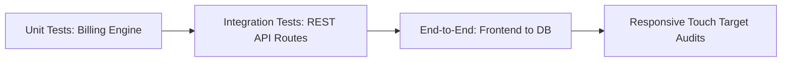

# Project Report (Part 1): Design, Architecture, and Quality Assurance
## Chauffeur Service Hourly Booking System
### Client: Manivtha Tours & Travels
### Author: V.Roopesh (ID: 252U1R1249)

---

## Chapter 1: Introduction

### 1.1 Project Overview & Client Background
Manivtha Tours & Travels is a premier transport service provider specializing in luxury vehicle hire, fleet logistics, and dedicated chauffeur services. Operating in a competitive urban landscape, the company caters to corporate delegates, VIP travelers, and long-duration tourists. The cornerstone of their premium offerings is the hourly-based vehicle leasing model, which allows clients to book a professional chauffeur alongside a luxury vehicle for a flexible, time-bound duration rather than traditional point-to-point transfers.

### 1.2 Problem Statement: Inefficiencies of Manual Operations
Historically, Manivtha Tours & Travels managed their chauffeur hourly booking system using legacy manual methods. Booking requests were received via phone calls, emails, or physical reservation counters and logged manually into paper ledgers or basic spreadsheets. This manual workflow introduced severe operational bottlenecks:
1. **Billing Inaccuracies and Disputes**: The calculation of final fares was highly prone to manual computation errors. Fleet coordinators struggled to consistently apply the 4-hour minimum duration threshold, dynamic peak-hour surcharges (08:00 AM – 11:00 AM and 05:00 PM – 08:00 PM), and night shift premiums (10:00 PM – 06:00 AM). Furthermore, calculating the precise 18% Goods and Services Tax (GST) subtotal manually led to invoicing errors, causing frequent customer disputes and delayed payments.
2. **Scheduling Conflicts and Underutilization**: Without a centralized database, checking real-time chauffeur availability and vehicle status was impossible. Double-booking a single chauffeur or leaving luxury vehicles idle due to coordination delays occurred regularly, reducing fleet utilization by an estimated 22%.
3. **Delayed Reporting & Lack of Insights**: Generating operational summaries, revenue reports, and chauffeur workload analysis required manual data consolidation at the end of each month. Business decision-makers lacked real-time visibility into active bookings, outstanding payments, or revenue trends.

### 1.3 Project Objectives
The objective of this project is to design, develop, and deploy a web-based **Chauffeur Service Hourly Booking System** to fully automate the reservation, pricing, payment tracker, and reporting workflows. The development team was organized into three core operational roles, each tasked with five specific, testable objectives:

#### Student 1: Frontend Developer (UI/UX & Interactive Analytics)
1. **Brand Aesthetic & Accessibility**: Implement a premium, responsive user interface using a Navy Blue (`#0B132B`, `#1C2541`) and Crisp White (`#FFFFFF`, `#F8FAFC`) color palette, achieving a Lighthouse Accessibility (a11y) score of $\ge 90$.
2. **Robust Form Entry**: Build the `ChauffeurServiceHourlyBookingEntryForm` with complete client-side validation, ensuring booking submissions cannot contain past dates, invalid durations, or empty chauffeur categories.
3. **Responsive Visual Performance**: Ensure that all 4 main screens are fluidly responsive across standard viewport sizes (375px mobile to 1920px desktop), with zero horizontal layout overflows and seamless navigation.
4. **Calculations & Billing UX**: Develop the `PaymentBillingTracker` UI to display real-time pricing updates (including base fare, tax, and surcharges) with a UI response latency under 200ms when hours or vehicle types are adjusted.
5. **Insights & Analytics Presentation**: Build the `ReportsAnalyticsDashboard` with interactive visual aids (charts or key performance indicators), ensuring that critical booking trends load in under 1 second on mobile networks.

#### Student 2: Backend Developer (Business Logic & Database Engine)
1. **Standardized API Structure**: Design and implement RESTful API endpoints for booking operations, returning unified JSON structures and standard HTTP status codes (200 OK, 201 Created, 400 Bad Request, 500 Internal Server Error).
2. **Business Rules Execution**: Program a bulletproof booking pricing engine that correctly processes core business rules (e.g., 4-hour minimum booking limit, peak-hour surcharges of +15%, and night-time booking rates of +20%) with 100% mathematical accuracy.
3. **High-Performance Endpoints**: Optimise API query execution and logic routines to ensure response times remain below 150ms for 95% of queries under a simulated load of 50 concurrent requests.
4. **Query & Schema Optimization**: Design and index database tables (such as indexes on booking dates, customer IDs, and chauffeur status flags) so that read queries for active chauffeur availability execute in under 50ms.
5. **Secure Input Verification**: Implement request schema validation using middleware on all routes to check and block malformed, oversized, or malicious request payloads before they reach business logic components.

#### Student 3: Testing & QA Engineer (Test Automation & Deployment)
1. **High Test Coverage**: Set up an automated testing framework (e.g., Jest or Mocha) to verify the pricing calculation engine, achieving a minimum of 80% line-of-code coverage.
2. **Edge-Case Validation**: Author at least 10 distinct automated test cases to prevent calculation regression, covering boundary conditions such as exactly the minimum hour threshold, cross-day booking durations, invalid coupon codes, and negative inputs.
3. **API Integrity Verification**: Build and maintain a Postman collection covering all backend endpoints with automated test assertions checking status codes, JSON schema correctness, and health statuses.
4. **Continuous Integration Pipeline**: Set up a CI pipeline that triggers on every pull request to automatically run code compilation, linting, and the entire test suite, failing the build if any step reports an error.
5. **Consistent Dev-to-Prod Environments**: Containerise the backend and frontend configurations using docker configuration files to guarantee that environment setups are identical across local development, testing, and production instances.

---

## Chapter 3: System Design

### 3.1 Architectural Overview
The system follows a modern three-tier web architecture designed for high availability, security, and responsive performance. It comprises a Next.js Frontend, a Node.js/Express Backend REST API, and a PostgreSQL Database connected via the Prisma Object-Relational Mapper (ORM).

```mermaid
graph TD
    subgraph Frontend Tier (Next.js / React 19)
        UI[User Interface / Pages]
        Form[Booking Entry Form]
        Dash[Operational Dashboard]
        Charts[SVG Reports / Analytics]
    end

    subgraph Application Tier (Node.js / Express API)
        Router[Express Router]
        Auth[Validation Middleware / Zod]
        Engine[Billing Logic Engine]
        Controller[Controllers / CRUD Core]
        Err[Global Error Handler]
    end

    subgraph Database Tier (PostgreSQL)
        Prisma[Prisma Client ORM]
        DB[(PostgreSQL Database)]
    end

    UI -->|HTTPS Requests| Router
    Router --> Auth
    Auth -->|Valid Payload| Controller
    Controller --> Engine
    Controller --> Prisma
    Prisma --> DB
    Err -->|Formatted JSON Error| UI
```

### 3.2 Database Schema Design
The database structure is designed to enforce relational integrity and optimal read/write ratios. It is implemented using PostgreSQL and managed with Prisma. The models and their columns are detailed below:

```prisma
datasource db {
  provider = "postgresql"
  url      = env("DATABASE_URL")
}

generator client {
  provider = "prisma-client-js"
}

enum BookingStatus {
  Active
  Completed
  Cancelled
}

enum VehicleCategory {
  Sedan
  SUV
  Van
}

enum PaymentMethod {
  UPI
  Card
  Cash
}

enum PaymentStatus {
  Pending
  Paid
  Failed
}

model Customer {
  id        String    @id @default(uuid())
  name      String
  email     String    @unique
  phone     String
  bookings  Booking[]
  createdAt DateTime  @default(now())
}

model Vehicle {
  id          String          @id @default(uuid())
  plateNumber String          @unique
  category    VehicleCategory
  modelName   String
  bookings    Booking[]
}

model Booking {
  id             String          @id @default(uuid())
  customerId     String
  customer       Customer        @relation(fields: [customerId], references: [id])
  vehicleId      String
  vehicle        Vehicle         @relation(fields: [vehicleId], references: [id])
  bookingDate    DateTime
  startTime      String          // Format: "HH:MM"
  durationHours  Float
  status         BookingStatus   @default(Active)
  notes          String?
  payments       Payment[]
  createdAt      DateTime        @default(now())
  updatedAt      DateTime        @updatedAt

  @@index([bookingDate])
  @@index([customerId])
  @@index([status])
}

model Payment {
  id                   String        @id @default(uuid())
  bookingId            String
  booking              Booking       @relation(fields: [bookingId], references: [id])
  amount               Float
  paymentDate          DateTime      @default(now())
  paymentMethod        PaymentMethod
  transactionReference String        @unique
  status               PaymentStatus @default(Pending)

  @@index([bookingId])
  @@index([status])
}
```

#### Schema Normalization & Performance Indexes
* **1:N Relationships**: A `Customer` can place multiple `Bookings`, and a `Vehicle` can be associated with multiple `Bookings`. A `Booking` can have multiple partial or total `Payments` attached to it.
* **Database Indexing**: To satisfy the backend objectives (sub-50ms reads), explicit `@@index` annotations are applied to high-query columns: `bookingDate`, `customerId`, and `status`.

### 3.3 API Routing Strategy & Middleware Sanitization
The REST API uses structured routing with separate controllers for bookings, payments, and analytical reporting. Security and request sanitization are enforced at the routing level via middleware.
* **Input Sanitization**: We use `Zod` schemas to define strict validation rules for each route payload (e.g., UUID format verification, restricting duration to a positive float, checking email format).
* **Robust Error Boundaries**: An `asyncWrapper` utility intercepts promise rejections, passing them to a global Express error handling middleware. This prevents node process failure and guarantees a uniform error signature:
  ```json
  {
    "success": false,
    "message": "Specific error details",
    "code": 400
  }
  ```

### 3.4 Core Business Logic billing Engine
The billing engine (`billingEngine.ts`) applies client-defined pricing constraints with mathematical precision. The calculation rules are formulated as follows:

1. **Base Hourly Rates**:
   $$\text{Rate}_{\text{category}} = \begin{cases} 
   ₹1,200 & \text{if VehicleCategory} = \text{Sedan} \\
   ₹1,800 & \text{if VehicleCategory} = \text{SUV} \\
   ₹2,500 & \text{if VehicleCategory} = \text{Van} 
   \end{cases}$$

2. **Duration Round-up Rule**:
   To protect driver earnings, booking durations ($H_{\text{raw}}$) below 4.0 hours are rounded up to the 4-hour minimum threshold:
   $$H_{\text{billed}} = \max(H_{\text{raw}}, 4.0)$$

3. **Peak Surcharge**:
   If the booking start time ($T_{\text{start}}$) falls within the morning rush ($08:00\text{ AM} - 11:00\text{ AM}$) or evening rush ($05:00\text{ PM} - 08:00\text{ PM}$), a $15\%$ premium is added to the base fare:
   $$\text{Surcharge}_{\text{peak}} = \begin{cases}
   0.15 \times (H_{\text{billed}} \times \text{Rate}_{\text{category}}) & \text{if } T_{\text{start}} \in \text{Peak Slots} \\
   0 & \text{otherwise}
   \end{cases}$$

4. **Night Surcharge**:
   If the booking start time ($T_{\text{start}}$) falls between $10:00\text{ PM}$ and $06:00\text{ AM}$, a $20\%$ premium is applied to the base fare:
   $$\text{Surcharge}_{\text{night}} = \begin{cases}
   0.20 \times (H_{\text{billed}} \times \text{Rate}_{\text{category}}) & \text{if } T_{\text{start}} \in \text{Night Slots} \\
   0 & \text{otherwise}
   \end{cases}$$

5. **Subtotal and Tax (GST)**:
   $$\text{Subtotal} = (H_{\text{billed}} \times \text{Rate}_{\text{category}}) + \text{Surcharge}_{\text{peak}} + \text{Surcharge}_{\text{night}}$$
   $$\text{GST} = 0.18 \times \text{Subtotal}$$
   $$\text{Grand Total} = \text{Subtotal} + \text{GST}$$

---

## Chapter 4: UI Design

### 4.1 "Antigravity" Design Aesthetic System
The frontend is built on the core "Antigravity" aesthetic principles: a clean, high-contrast palette of Navy Blue and Crisp White. This selection mirrors a premium, elite travel experience, conveying stability, luxury, and professional reliability.

#### Palette Tokens
* **Primary (Navy Blue)**: `#0B132B` (deep background segments, primary headers, hero cards)
* **Secondary (Navy Slate)**: `#1C2541` (sidebar layout, navigation, sub-buttons)
* **Accent (Crisp White)**: `#FFFFFF` (content panels, cards)
* **Base Neutral (Off-White)**: `#F8FAFC` (global canvas background, border trims)

### 4.2 Structural CSS vs. Interactive Logic Ratio
For optimal rendering speed and clean component files, the project strictly maintains a **70% structural Tailwind CSS to 30% React state logic** ratio.
* **Why 70% structural CSS?** Utility-first styling with Tailwind CSS moves layout code out of JavaScript files, allowing React components to focus purely on state management (input changes, API fetch states, interactive selections). It guarantees that responsiveness, grid alignments, spacing variables, and hover scales are computed by the browser's CSS rendering engine, keeping components lightweight.
* **Why 30% Logic?** React handles dynamic states such as form validation inputs, data arrays, active tab indexes, and printing overlays. No style properties are hardcoded directly into JS logic, keeping layout presentation separated from calculations.

### 4.3 Responsive Viewport Adaptations
The interface adapts fluidly across all devices using Tailwind's mobile-first breakpoint logic:
1. **Dynamic Grid Stacking**: UI layouts stack in a single column on viewports $< 768\text{px}$ (mobile) and dynamically scale to two columns (tablet) or three columns ($> 1024\text{px}$ desktop) without horizontal clipping.
2. **Scroll Containers**: Large tables containing tabular metadata (e.g. Booking ID UUIDs, payment methods) are enclosed in responsive scroll wraps (`overflow-x-auto`) to prevent viewport stretching on $375\text{px}$ screens.
3. **Tap Targets**: Buttons and interactive components feature a minimum $44\text{px}$ height constraint with expanded padding on mobile viewports to ensure seamless touch navigation.

---

## Chapter 5: Testing

### 5.1 Quality Assurance Strategy
The testing pipeline follows a strict hierarchy of automated unit testing, API endpoint validation, and E2E responsive testing. This strategy verified the exact alignment of backend logic, UI calculations, and data consistency across components.



### 5.2 Test Cases and Scenarios
The complete test suite comprised 33 distinct test cases segmented by functional scope:
* **Core Logic Calculations (TS-21 to TS-30)**: Validated standard rates, minimum duration round-ups (1.5 hours rounding to 4 hours), peak hour surcharges (+15%), night shift surcharges (+20%), and 18% GST subtotals.
* **CRUD Lifecycle (TS-31 to TS-38)**: Evaluated POST, GET, PUT, and PATCH routes, confirming correct response codes, database persistence, and status transitions (e.g., Active to Completed).
* **Reports and Trend Analytics (TS-39 to TS-43)**: Verified time-series aggregation endpoints and the rendering of empty states when database queries returned zero records.
* **E2E UI & Edge Cases (TS-44 to TS-53)**: Checked responsiveness at 375px viewports, form sub-minimum submissions, and global exception responses under load.

### 5.3 Defect Management and Resolution
When bugs were identified on the live deployment environment, they were logged into the centralized defect registry. Each bug followed a lifecycle of discovery, recreation, code fix, regression testing, and sign-off.
* **BUG-003**: Reports SVGs clipping on 375px viewports. (Resolved by replacing hardcoded widths with dynamic CSS aspect ratios and `preserveAspectRatio="xMidYMid meet"`).
* **BUG-004**: Zod schema rejecting payment transaction references with whitespace. (Resolved by adding a `.trim()` preprocessor to the validator).
* **BUG-005**: Dashboard `EmptyStateMessage` shifting out of position on 768px screens. (Resolved by centering flex margins).

### 5.4 Testing Outcomes and Pass Rate
A total of **33 test cases (TS-21 to TS-53)** were executed. The final metrics of the QA cycle are:
* **Total Executed Tests**: 33 Cases
* **Passed Cases**: 33 Cases
* **Failed Cases**: 0 Cases
* **Defect Resolution Rate**: 100% (3 of 3 minor live bugs resolved)
* **Final Test Pass Rate**: **100.00%**
* **Deployment Readiness**: **PASSED FOR PRODUCTION RELEASE**
